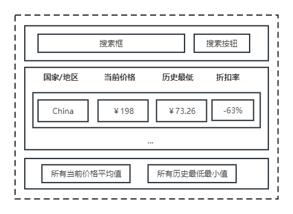

# 写在前面
欢迎来到321CQU 2023年纳新笔试题，笔试内容包括基本问题和项目设计两个部分，其中基本问题是所有人均需要作答的，项目设计则可以从其中选择一项进行作答（也可以多选回答）

回答提交方式：请提交pr至本项目当前分支，你的代码应该位于以你姓名命名的文件夹，并在其中的readme文件中提供**联系方式**以便我们可以联系到你，文件层级示例如下：
- 张三
	- readme.md
	- XXX

基本问题可以写在readme.md中，或者在其他markdown文件中；同时，请在reademe文件中提供基本的项目介绍，说明你选择的题目、采用的技术和其他必要信息
**请一定要提供联系方式**、**请一定要提供联系方式**、**请一定要提供联系方式**

# 基本问题
1. 你为什么想加入321CQU，你期望从中获得什么？你想为321CQU做什么？
2. 会使用的编程语言（Java、python、swift等）？，做过哪些项目或者小Demo？（如果可以，请提供相关项目的链接）
3. 期望参与的开发方向（后端、iOS、安卓、小程序），目前你熟悉的开发方向？
4. （选做）其他你想和我展示的信息（自我介绍、称述、项目经历，Anything you like）


# 项目设计
以下试题**选择一项作答**即可（支持多选）

## 后端——服务器开发方向
现在提供后端API[文档](https://api.321cqu.com/docs)和调用密钥："hLrOSgvl5eUzJR1sSeen9g"（该密钥仅可应用于/v1/test/路径下score_query与/v1/authorization/路径下login、refreshToken等接口，纳新结束后会失效，其中成绩查询接口回传测试数据）
> 服务器采取OAuth2.0身份鉴权方案，login和refreshToken所获的Token应当以“Bearer xxxx”的形式在Authorization头中提供给服务器

> API文档打开可能长时间白屏，这是因为相关js文件没有国内CDN节点的原因，你可能需要耐心等待或者科学上网

请使用你熟悉的语言（Java、swift、go、python…）相应框架和任何你需要的其他工具（redis、sqlite等），搭建能够提供成绩查询接口的服务端程序。你需要在接口提供的基础查询服务上增加以下功能：
- 成绩查询缓存：在短时间的重复查询不会多次向服务器发送查询请求，而是回传缓存中的数据
- 成绩记录：获取的成绩信息需要存储到数据库中，请设计合适的表结构和外键关联进行数据保存（请采用sqlite作为本项目的数据库以方便进行结果校验）
- 错误处理：提供适当的错误处理方式以避免服务器请求返回http 500状态码
- 日志记录：请提供接口访问日志和程序报错相关日志记录
- 单元测试：对于上述功能，均应当提供相应单元测试以保证功能运行正常。尽量实现代码100%覆盖
- 如果为动态语言，在可能的情况下应该提供详细的类型注解（python的typing hint，ts等）

## 后端——网络爬虫方向
请在[mycqu最新pr](https://github.com/Hagb/pymycqu/pull/10)的基础上，修复目前失效的图书馆借阅信息查询功能

## 移动应用开发方向
请自行设计UI，使用上文”服务器开发方向“中的成绩查询接口，编写建议的界面实现成绩查询功能。

## 小程序/网页前端开发方向
### 0. Prerequisites

完成本任务你可能需要用到的知识：

- 技术
  - [React](https://react.docschina.org/) or [Vue](https://cn.vuejs.org/) or ... （不限制前端框架，但必须是组件化思想的）
  - [Typescript](https://www.typescriptlang.org/)（Typescript **ONLY** !）
  - [Promise](https://developer.mozilla.org/zh-CN/docs/Web/JavaScript/Reference/Global_Objects/Promise)
  - [async](https://developer.mozilla.org/zh-CN/docs/Web/JavaScript/Reference/Statements/async_function)、[await](https://developer.mozilla.org/zh-CN/docs/Web/JavaScript/Reference/Operators/await)
  - [Fetch](https://developer.mozilla.org/zh-CN/docs/Web/API/Fetch_API/Using_Fetch)
- 推荐阅读
  - [Thinking in React](https://react.docschina.org/docs/thinking-in-react.html)
  - [函数式编程思维](https://book.douban.com/subject/26587213/)


### 1. Background

​	我们经常喜欢在Steam平台上享受游戏的乐趣，但对于大多数游戏而言都是需要付费购买的，而每种游戏在不同的时间段价格也有所不同（例如节假日，活动打折等）。因此，一个用于收集历史游戏价格数据的软件似乎可以帮助我们很好的预测每款游戏的价格走向趋势，使我们在最低价或最低价附近时入手。

​	因此[Steam DB](https://steamdb.info/) 应运而生


### 2. Task

​	你需要设计一个用于搜索的Steam游戏价格的展示界面，可以参考这个[参考页面](https://steamdb.info/app/1426210/)。本次任务主要复现该页面的**Steam prices in all regions**部分，并且做出一些简化。具体的流程为：

1. 用户在输入框中输入游戏名称（本文以**It Takes Two**为例）
2. 通过网络请求获得该游戏的价格数据（使用我们给定的接口，不需要自己单独爬数据）
3. 对获得的数据进行相关预处理（例如：计算折扣率、计算平均价格，最低价格等）
4. 对处理后的数据进行展示（参考下文的设计图）
5. 当用户点击某一国家/地区的数据时，将该行整到表格的第一行（注意：与**参考页面**逻辑不同噢！这里考察React中的事件处理）

| 任务名称       | 涉及到的知识          | 分值占比 |
| -------------- | --------------------- | -------- |
| 网络接口的封装 | Promise、async、await | 30%      |
| 数据的处理     | 函数式编程思维        | 20%      |
| 组件设计、开发 | React组件设计、开发   | 50%      |

#### 设计图

这是一张十分草率且简陋的设计图，开发者能领会其意即可，强烈鼓励开发者设计出更好看，有趣的页面



#### 2.1 网络接口的封装

使用我们给定的接口获取数据，以下是接口说明

- `PATH`：`http://platopeanut.top:3210/recruit/2023/getSteamInfo/:gameName`
- `METHOD`：`GET`

注意：`PATH`中的`gameName`只能填`It Takes Two`，填写其他内容或不填则返回的数据为空数组

为了方便开发者测试，因此这里的`METHOD`设置为`GET`，开发者可以直接使用浏览器访问[此链接](http://platopeanut.top:3210/recruit/2023/getSteamInfo/It%20Takes%20Two)就可以看得到返回的结果。为了方便对返回结果的观察，推荐在浏览器安装[Fe Helper](https://www.baidufe.com/fehelper/index/index.html)插件，它可以格式化JSON文本

该接口返回的数据类型声明如下，为了更好的理解，请对照浏览器上的返回数据。

```typescript
type ResponseType = {
    status: boolean
    msg: string
    data: {
    	gameName: string
        priceData: PriceItem[]
    }
}

type PriceItem = {
	country: string
    currentPrice: number
    lowestRecordedPrice: number
}
```

##### Tips

强烈建议在进行网络请求等异步IO时，使用async，await语法糖

#### 2.2 数据的处理

在获得数据后，你需要计算

- 每一项的当前价格与最低价格之间的折扣率，以中国地区为例，当前价格为198，最低价格为73.26，因此折扣率为$1 - \frac{73.26}{198} \approx 0.63$
- 所有当前价格的平均价格
- 所有历史最低价格的最小值

##### Tips

思考如何尽量的使用函数式编程思维来解决上述问题，如果没有太多的想法的话也可以用传统的命令式

## 其他
如果你觉得上述项目不能很好的展现你的优势，你也可以自行选择任何你认为合适的项目进行提交

函数式编程三板斧：`Filter`、`Map`、`Reduce`


#### 2.3 组件设计、开发

组件化思想是前端发展的必要趋势，市面上火热的React、Jetpack Compose、Swift UI都是采用了组件化的思想。因此对于本任务的界面设计，你应该将页面合理的拆分为一个个小的组件，每个组件功能单一且清晰

- 画出页面组件关系图（或列出组件树）
- 当用户点击某一项国家/地区的价格时，将该行调整到列表的第一行（考察状态提升、事件绑定）
